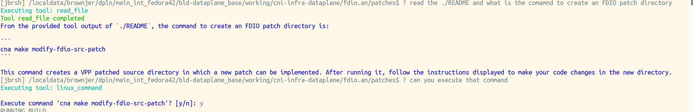

# Jibberish Tool System

The jibberish tool system allows the AI to gather additional context by executing tools when answering questions. This enables more informed and accurate responses.

## How It Works

1. **Ask a Question**: When you ask a question using `?`, the AI can determine if it needs additional information
2. **Tool Request**: If the AI needs more context, it will request a tool in its response
3. **Tool Execution**: Jibberish automatically detects tool requests and executes the appropriate tools
4. **Enhanced Response**: The AI is then given the tool outputs and provides a complete answer

## Available Tools

### read_file
Reads the contents of a file and provides them as context to the AI.

**Usage patterns the AI can use:**
- `TOOL_CALL: read_file(filepath="/path/to/file")`

**Parameters:**
- `filepath` (required): Path to the file to read
- `max_lines` (optional): Maximum number of lines to read
- `start_line` (optional): Line number to start reading from (default: 1)

### write_file
Writes content to a file at the specified location. Creates directories if needed and can overwrite or append to existing files. Useful for saving AI responses, generated content, or notes.

**Usage patterns the AI can use:**
- `TOOL_CALL: write_file(filepath="/path/to/file", content="text to write")`

**Parameters:**
- `filepath` (required): Path where the file should be written
- `content` (required): Content to write to the file
- `append` (optional): If true, append to file instead of overwriting (default: false)
- `encoding` (optional): Text encoding to use (default: utf-8)

### linux_command
Executes Linux shell commands with full support for built-in commands, command chaining, and security features. This tool uses the same command execution logic as the jibberish interactive shell, ensuring consistent behavior.

**Usage patterns the AI can use:**
- `TOOL_CALL: linux_command(command="ls -la")`
- `TOOL_CALL: linux_command(command="mkdir project && cd project")`
- `TOOL_CALL: linux_command(command="pwd; whoami; date")`

**Parameters:**
- `command` (required): The Linux command to execute. Supports:
  - Simple commands: `ls`, `pwd`, `whoami`
  - Commands with options: `ls -la`, `ps aux`
  - Command chaining with `&&`: `mkdir dir && cd dir`
  - Command chaining with `;`: `pwd; ls; date`
  - Built-in commands: `cd`, `export`, `history`

### Real-World Example: Reading Documentation and Executing Commands



## Creating Custom Tools

To create a new tool:

1. **Create the tool class** (inherit from `Tool`):

```python
from app.tools.base import Tool

class MyCustomTool(Tool):
    @property
    def name(self) -> str:
        return "my_tool"
    
    @property  
    def description(self) -> str:
        return "Description of what this tool does"
    
    @property
    def parameters(self) -> Dict[str, Any]:
        return {
            "type": "object",
            "properties": {
                "param1": {
                    "type": "string",
                    "description": "Description of parameter"
                }
            },
            "required": ["param1"]
        }
    
    def execute(self, param1: str, **kwargs) -> str:
        # Tool implementation
        return "Tool result"
```

2. **Register the tool**:

```python
from app.tools import ToolRegistry
ToolRegistry.register(MyCustomTool())
```

## Tool Request Formats

The AI can request tools using any of these formats:

1. **Function-style**: `TOOL_CALL: tool_name(param="value")`
2. **JSON-style**: `USE_TOOL: tool_name {"param": "value"}`
3. **Tag-style**: `[TOOL] tool_name: param=value`

## Configuration

- **Max iterations**: Tools can be chained up to 3 iterations deep
- **Error handling**: Tool failures are reported but don't stop the conversation
- **Large files**: Files over 1MB require explicit `max_lines` parameter

## Tips

- Tools work best with specific questions about files or system state
- The AI will automatically determine when tools are needed
- You can ask follow-up questions that build on the tool context
- Tool outputs are preserved within the conversation for follow-up questions